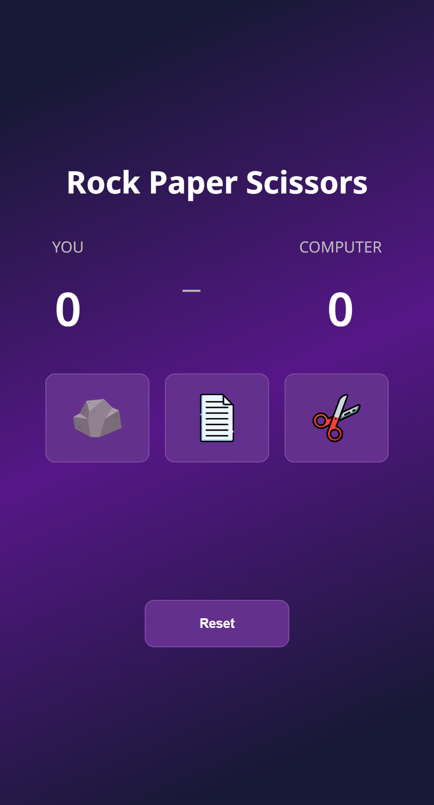

# Odin Project - Rock Paper Scissors

## Table of contents

- [Odin Project - Rock Paper Scissors](#odin-project---rock-paper-scissors)
  - [Table of contents](#table-of-contents)
  - [Overview](#overview)
    - [Screenshot](#screenshot)
    - [Links](#links)
  - [My process](#my-process)
    - [Built with](#built-with)
    - [What I learned](#what-i-learned)
      - [1. JavaScript Fundamentals](#1-javascript-fundamentals)
      - [2. Game Logic](#2-game-logic)
      - [3. DOM Manipulation](#3-dom-manipulation)
      - [4. Event Listeners](#4-event-listeners)
      - [5. Score Tracking](#5-score-tracking)
      - [6.Basic UI and Styling (CSS)](#6basic-ui-and-styling-css)
    - [Challenges](#challenges)
  - [Author](#author)
  - [Acknowledgments](#acknowledgments)

## Overview

### Screenshot

<figure style="width: 100%; display: flex; align-items: center; flex-direction: column">
  
    <figcaption>Preview</figcation>
</figure>

### Links

- Live Site URL: [Live site URL](https://rock-paper-scissors-tau-drab.vercel.app/)

## My process

### Built with

- Semantic HTML5 markup
- Flexbox
- Mobile-first workflow
- JavaScript

### What I learned

This project is part of The Odin Project curriculum. The goal was to build a simple Rock Paper Scissors game using JavaScript, HTML, and CSS.

#### 1. JavaScript Fundamentals

- Variables (let, const)
- Data types (strings, numbers)
- Functions and return values
- Conditional logic (if, else if, else)
- The switch statement
- Comparison operators (===, >, <)
- Browser events

#### 2. Game Logic

- Comparing player vs computer choices
- Determining win, lose, or draw
- Structuring reusable functions

#### 3. DOM Manipulation

- Selecting elements (querySelector)
- Updating text content
- Handling button clicks

#### 4. Event Listeners

- Making the game interactive
- Responding to user input (button clicks)

#### 5. Score Tracking

- Keeping track of player and computer scores
- Updating UI dynamically

#### 6.Basic UI and Styling (CSS)

- Layout using Flexbox
- Centering elements
- Styling buttons and text

### Challenges

- Understanding event flow in JavaScript
- Making animations (like score increment effects)

## Author

- Website - [Azam Azis](https://github.com/AzamAzis)

## Acknowledgments

Icons used in this project are provided by creators from [Flaticon](https://www.flaticon.com/).

- [rock.png](https://www.flaticon.com/free-icon/granite_6223796?term=stone&page=1&position=3&origin=search&related_id=6223796)
- [paper.png](https://www.flaticon.com/free-icon/text_3099976?term=paper&page=5&position=83&origin=search&related_id=3099976)
- [scissors.png](https://www.flaticon.com/free-icon/cut_1151147?term=cut&page=1&position=13&origin=tag&related_id=1151147)
- [party-popper.png](https://www.flaticon.com/free-icon/party-popper_3146600?term=party&page=1&position=3&origin=search&related_id=3146600)
